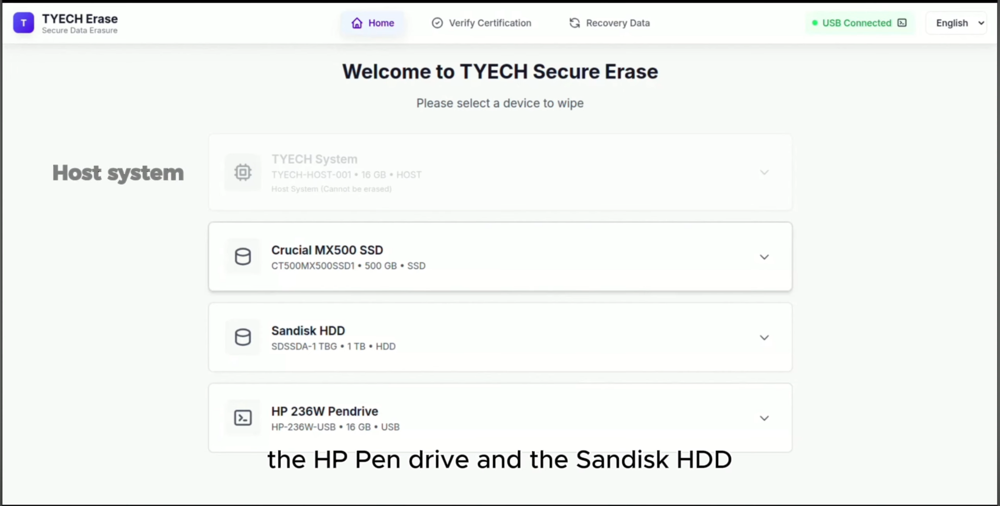
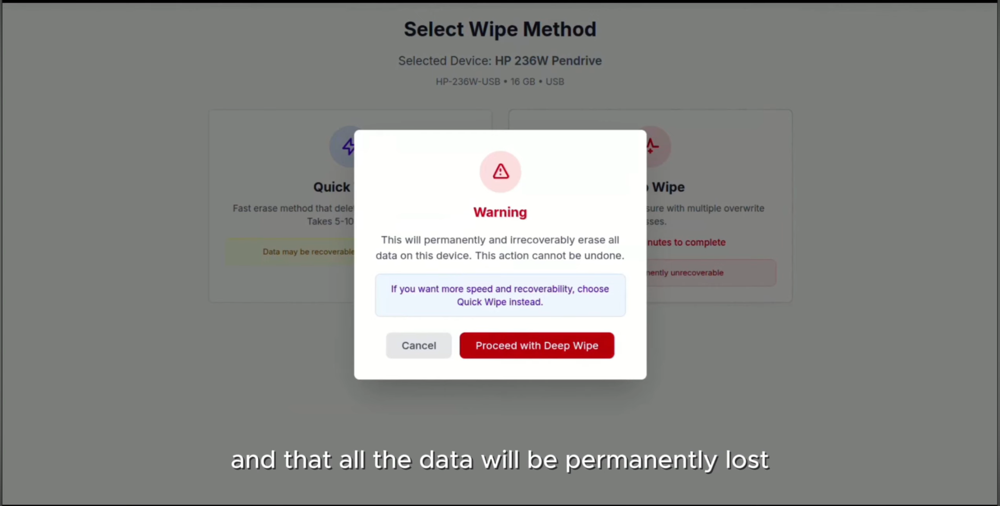
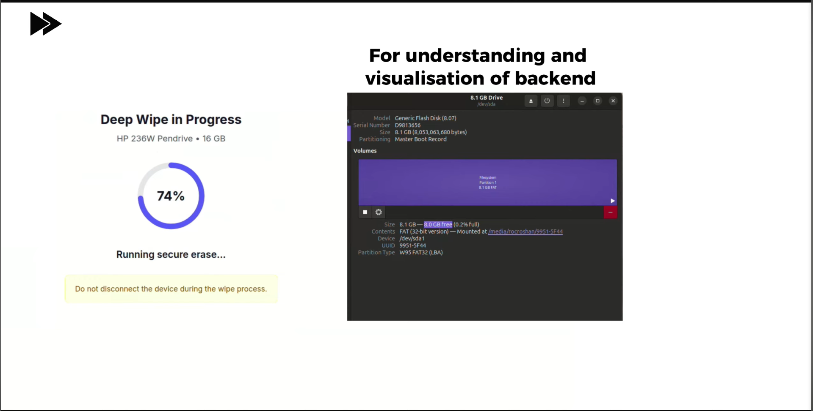
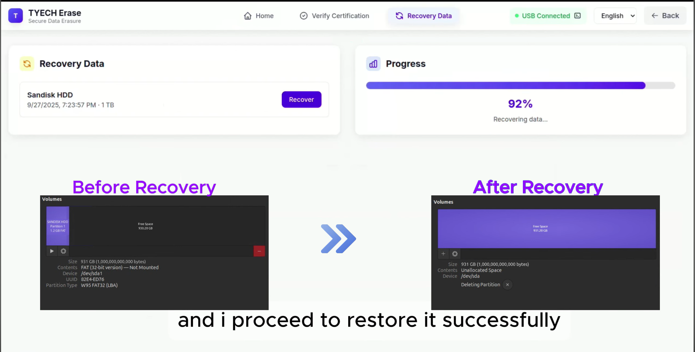
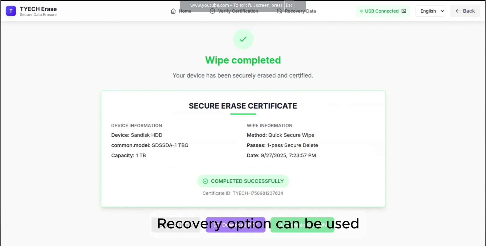

# Tyech Secure Eraser - Kiosk & Web Enterprise

A Flask-based web application and enterprise solution for secure device data erasure, featuring advanced mobile support, certificate generation, and competitive tracking.

## 📋 Project Overview

This project is a **secure data eraser application** with:
- **Web Interface**: Flask-based dashboard for managing erasure operations
- **Kiosk Mode**: Specialized interface for in-person device erasure
- **API**: RESTful endpoints for automation and integration
- **Certificate Generation**: Automated certificate creation for compliance
- **Advanced Features**: Mobile device support, batch operations, detailed reporting

## 🎬 Demo Video

- Watch here: https://youtu.be/t7TazOitMWE?si=v8UP_WXLU39qVQLm

## 🖼️ Screenshots

<table>
   <tr>
      <td align="center" width="50%"><b>1) Home / Landing Page</b></td>
      <td align="center" width="50%"><b>2) Device Discovery Page</b></td>
   </tr>
   <tr>
      <td align="center"></td>
      <td align="center"></td>
   </tr>
   <tr>
      <td align="center">Main entry screen with primary navigation.</td>
      <td align="center">Detected devices and categories before erase selection.</td>
   </tr>
   <tr>
      <td align="center" width="50%"><b>3) Erase Workflow Page</b></td>
      <td align="center" width="50%"><b>4) Recovery Data / Progress Page</b></td>
   </tr>
   <tr>
      <td align="center"></td>
      <td align="center"></td>
   </tr>
   <tr>
      <td align="center">Device and method selection to start secure wipe.</td>
      <td align="center">Recovery/progress tracking view during post-wipe flow.</td>
   </tr>
   <tr>
      <td align="center" colspan="2"><b>5) Wipe Completed Certificate Page</b></td>
   </tr>
   <tr>
      <td align="center" colspan="2"></td>
   </tr>
   <tr>
      <td align="center" colspan="2">Final completion screen showing secure erase certificate details.</td>
   </tr>
</table>

## 🚀 Quick Start

### Prerequisites
- Python 3.8+
- pip (Python package manager)
- (Optional) Virtual environment like venv or conda

### Installation

1. **Clone the Repository**
   ```bash
   git clone https://github.com/roshan-melvin/ieee-hkn-budget.git
   cd ieee-hkn-budget
   ```

2. **Create Virtual Environment** (Recommended)
   ```bash
   python3 -m venv venv
   source venv/bin/activate  # On Windows: venv\Scripts\activate
   ```

3. **Install Dependencies**
   ```bash
   pip install -r requirements.txt
   ```

4. **Run the Application**
   ```bash
   python app.py
   # OR
   python main.py
   ```

5. **Access the Web Interface**
   - Open browser to: `http://localhost:5000`
   - Default port: 5000 (configurable in app.py)

## 📁 Project Structure

```
.
├── app.py                    # Main Flask application entry point
├── main.py                   # Alternative entry point
├── requirements.txt          # Python dependencies
├── engine/                   # Core erasure engine
│   ├── erase_engine.py      # Main erasure logic
│   ├── advanced_erase.py    # Advanced erasure modes
│   ├── advanced_mobile.py   # Mobile device support
│   ├── certificate_generator.py  # Certificate generation
│   ├── device_utils.py      # Device detection utilities
│   ├── progress_tracker.py  # Real-time progress tracking
│   ├── run_erase_job.py     # Job execution handler
│   ├── utils.py             # Utility functions
│   └── keys/                # RSA keys for certificate signing
├── templates/               # HTML templates
│   ├── layout.html         # Base template
│   ├── index.html          # Home page
│   ├── dashboard.html      # Main dashboard
│   ├── erase.html          # Erasure interface
│   ├── devices.html        # Device management
│   ├── certificates.html   # Certificate viewer
│   ├── admin.html          # Admin panel
│   ├── api.html            # API documentation
│   ├── about.html          # About page
│   └── ...                 # Other pages
├── static/                  # Static assets
│   ├── css/                # Stylesheets (Bootstrap)
│   ├── js/                 # JavaScript files
│   └── fonts/              # Font files
├── docs/                    # Documentation
│   ├── ADVANCED_FEATURES.md
│   ├── COMPETITION_ENHANCEMENTS.md
│   ├── SUDOERS_INSTRUCTIONS.md
│   └── generate_tool_flowchart.py
└── .gitignore             # Git ignore rules

```

## ⚙️ Configuration

### Environment Variables
Create a `.env` file in the root directory:
```env
FLASK_ENV=development
FLASK_DEBUG=True
SECRET_KEY=your-secret-key-here
```

### Application Settings
Edit `app.py` to configure:
- Host and port
- Debug mode
- File upload limits
- Erasure parameters

## 📦 Dependencies

Key Python packages (see `requirements.txt` for full list):
- **Flask**: Web framework
- **Flask-Cors**: Cross-origin resource sharing
- **requests**: HTTP library for APIs
- **cryptography**: Certificate and encryption operations

## 🔑 Features

### Erasure Operations
- **Standard Erase**: Basic secure data deletion
- **Advanced Erase**: Multi-pass overwrite patterns
- **Mobile Support**: Android/iOS device handling
- **Batch Operations**: Multiple devices simultaneously

### Certificates
- **Auto-generation**: Automatic certificate creation
- **Custom Parameters**: Configurable certificate details
- **Signing**: RSA-based certificate signing
- **Export**: Certificate download and distribution

### Monitoring
- **Real-time Progress**: Live erasure status updates
- **Job Tracking**: Historical operation logs
- **Device Detection**: Automatic device identification
- **Reporting**: Detailed completion reports

### Web Interface
- **Dashboard**: Overview of all operations
- **Device Management**: Add/remove/configure devices
- **API Docs**: Complete API reference
- **Admin Panel**: System configuration

## 🛠️ Development

### Running in Development Mode
```bash
export FLASK_ENV=development
export FLASK_DEBUG=True
python app.py
```

### Key Files to Understand

1. **app.py / main.py**: Flask application setup and routes
2. **engine/erase_engine.py**: Core erasure algorithm
3. **engine/certificate_generator.py**: Certificate handling
4. **templates/layout.html**: Base HTML structure

### Adding New Features

1. **New API Endpoint**: Edit `app.py` and add route
2. **New Erasure Method**: Update `engine/erase_engine.py`
3. **New UI Page**: Create HTML in `templates/` and add route

## 📖 Documentation

Detailed documentation available in `/docs`:
- **ADVANCED_FEATURES.md**: In-depth feature explanations
- **COMPETITION_ENHANCEMENTS.md**: Enhanced capabilities
- **SUDOERS_INSTRUCTIONS.md**: Linux permission setup

## ⚠️ Important Notes on Git

### Files NOT Pushed to GitHub (in .gitignore)

The following large files are excluded from version control:

1. **TyechUSB/** (1.8+ GB)
   - Linux ISO and rootfs files
   - Device firmware and system files
   - Must be rebuilt/obtained separately

2. **Virtual Environments**
   - `tyech/` - Python virtual environment
   - `venv/` - Standard venv directory
   - Install locally: `python3 -m venv venv && pip install -r requirements.txt`

3. **Sensitive Files**
   - `certificates/` - Generated certificates and JSON files
   - `keys/private_key.pem` - Private cryptographic keys (public key included)
   - `.json` files - Configuration and certificate data

4. **Python Cache**
   - `__pycache__/` directories
   - `*.pyc` compiled files
   - `.pytest_cache/` test caches

5. **Other Large Files**
   - `*.iso` - ISO images
   - `*.bin.zst` - Compressed firmware
   - `*.squashfs` - Compressed filesystems

### What IS Tracked

✅ Source code files:
- `app.py`, `main.py` - Application entry points
- `engine/*.py` - Core logic and utilities
- `requirements.txt` - Python dependencies

✅ Web assets:
- `templates/*.html` - HTML templates
- `static/css/` - Stylesheets
- `static/js/` - JavaScript
- `static/fonts/` - Web fonts

✅ Documentation:
- `docs/*.md` - Markdown documentation
- `README.md` - This file

### Setting Up from GitHub

When cloning from GitHub, you need to:

```bash
# Clone repository
git clone https://github.com/roshan-melvin/ieee-hkn-budget.git
cd ieee-hkn-budget

# Install Python dependencies
python3 -m venv venv
source venv/bin/activate
pip install -r requirements.txt

# Rebuild TyechUSB (if needed)
# Follow TyechUSB/README.md or instructions in docs/

# Generate certificates (if needed)
python engine/certificate_generator.py

# Run the app
python app.py
```

## 🔒 Security Considerations

⚠️ **IMPORTANT**: This repository contains:
- Public RSA keys in `engine/keys/public_key.pem`
- Private keys should NEVER be committed (properly ignored)
- Certificates are sensitive data (properly ignored)

## 📝 License

[Add your license here]

## 👤 Author

- **roshan-melvin** - GitHub username

## 📞 Support

For issues and questions, please open an issue on GitHub.

## 🎯 Next Steps

1. Install dependencies: `pip install -r requirements.txt`
2. Review `docs/` folder for detailed documentation
3. Check `ADVANCED_FEATURES.md` for capabilities
4. Run `python app.py` to start the web server
5. Access http://localhost:5000 in your browser

---

**Last Updated**: December 2025
